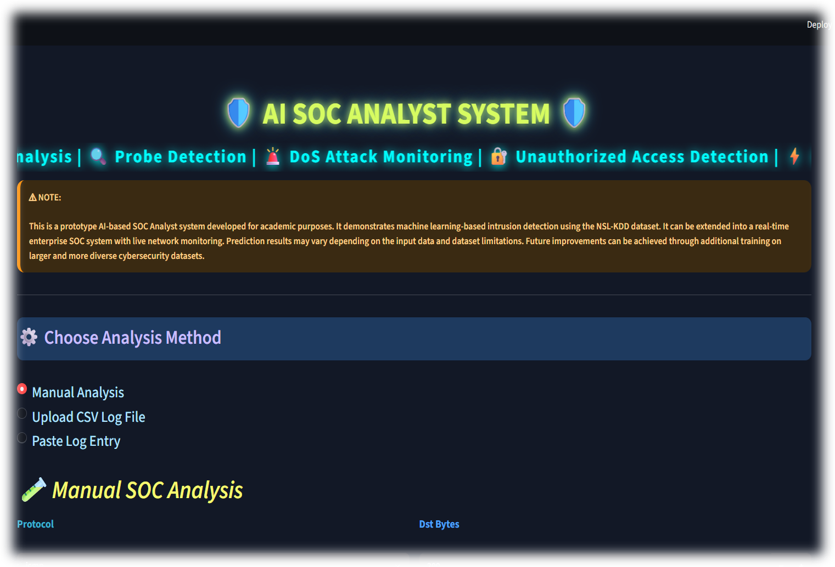
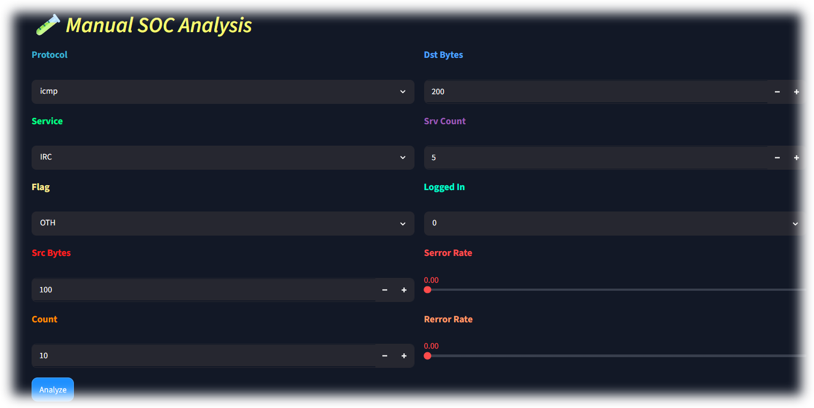
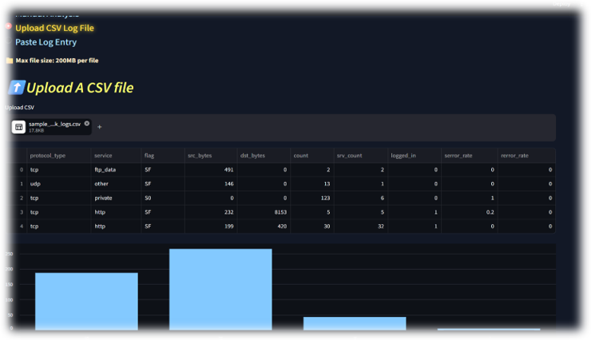
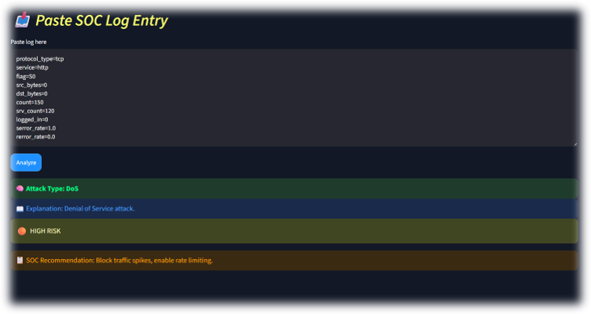
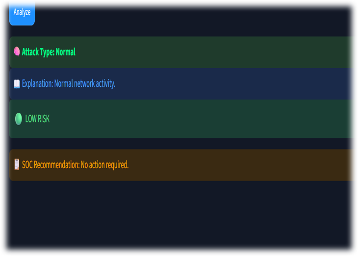
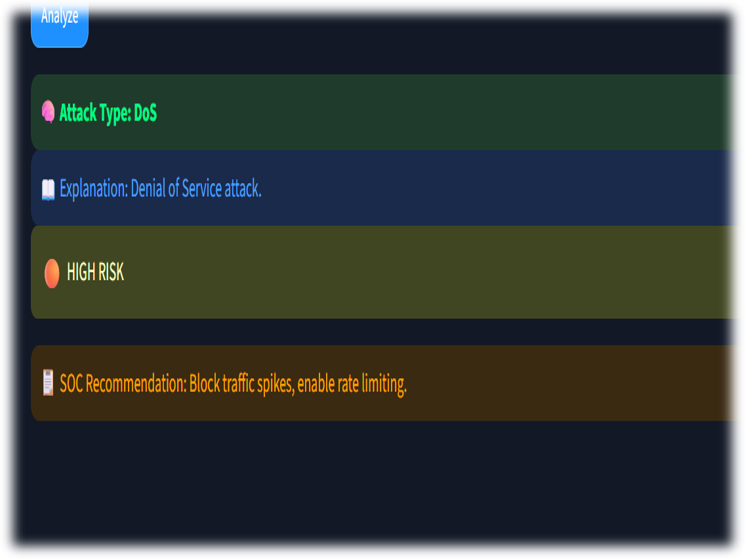

# 🛡️ AI SOC Analyst System

An **AI-powered Security Operations Center (SOC) Analyst System** for network intrusion detection, attack classification, risk assessment, and security recommendations using **Machine Learning and the NSL-KDD dataset**.

The system analyzes network traffic features, classifies activity into security categories, assigns a risk level, and provides recommended SOC actions. A **Streamlit dashboard** provides multiple ways to analyze network activity.

---

## 🚀 Project Overview

Security Operations Centers generate large amounts of network and security data that must be analyzed to identify suspicious activity.

This project demonstrates a machine-learning-based approach to assist SOC analysts by:

* 🔍 Detecting potentially malicious network activity
* 🧠 Classifying network attacks into security categories
* ⚠️ Assigning risk levels to detected activity
* 📋 Providing SOC-oriented recommendations
* 📊 Analyzing uploaded network log files
* 💻 Providing an interactive Streamlit dashboard

The project uses the **NSL-KDD dataset** and a **Random Forest classifier** for intrusion classification.

> **Note:** This is an academic/prototype SOC system based on the NSL-KDD dataset. It is not a production enterprise IDS or a live SOC monitoring platform.

---

## 🎯 Objectives

* Build a machine-learning model for network intrusion detection
* Analyze network traffic and security-related features
* Categorize different types of attacks
* Prioritize threats using risk levels
* Provide actionable security recommendations
* Develop an interactive SOC-style dashboard
* Demonstrate an end-to-end ML security workflow

---

## 🔄 System Workflow

```text
NSL-KDD Network Traffic
        ↓
Data Preprocessing
        ↓
Attack Type Mapping
        ↓
Feature Selection
        ↓
Categorical Encoding
        ↓
Train/Test Split
        ↓
Random Forest Classifier
        ↓
Attack Prediction
        ↓
Risk Assessment
        ↓
SOC Recommendation
        ↓
Streamlit SOC Dashboard
```

---

## 📊 Dataset

The project uses the **NSL-KDD network intrusion detection dataset**.

The training dataset contains:

* **125,973 network records**
* **43 columns**
* **23 raw attack types**
* Numerical and categorical network traffic features

### Dataset Files

```text
data/
├── KDDTest+.txt
├── KDDTrain+.txt
├── nsl_kdd_enriched.csv
└── README.md
```

---

## 🛡️ Attack Classification

The original attack types are grouped into five security categories:

| Security Category       | Examples                                                                    |
| ----------------------- | --------------------------------------------------------------------------- |
| 🟢 Normal               | Normal network activity                                                     |
| 🔴 DoS                  | Neptune, Smurf, Back, Teardrop, Pod, Land                                   |
| 🟡 Probe                | Satan, IPSweep, Nmap, Portsweep                                             |
| 🔴 Unauthorized Access  | Guess_Passwd, FTP_Write, IMAP, Warezclient, Warezmaster, Multihop, PHF, Spy |
| 🚨 Privilege Escalation | Buffer_Overflow, Rootkit, Loadmodule, Perl                                  |

---

## ⚠️ Risk Assessment

Each predicted category is mapped to a risk level:

| Attack Category      | Risk Level  |
| -------------------- | ----------- |
| Normal               | 🟢 Low      |
| Probe                | 🟡 Medium   |
| DoS                  | 🔴 High     |
| Unauthorized Access  | 🔴 High     |
| Privilege Escalation | 🚨 Critical |

This allows the system to prioritize detected activity rather than simply displaying an attack classification.

---

## 🧠 Machine Learning Model

The project uses a **Random Forest Classifier**.

### Model Configuration

```text
Algorithm: Random Forest Classifier
Number of Estimators: 100
Random State: 42
Test Size: 20%
```

### Selected Features

The model uses 10 selected features:

```text
protocol_type
service
flag
src_bytes
dst_bytes
count
srv_count
logged_in
serror_rate
rerror_rate
```

Categorical features are encoded using:

* `protocol_encoder.pkl`
* `service_encoder.pkl`
* `flag_encoder.pkl`

The trained model is stored as:

```text
soc_model.pkl
```

### Model Performance

**Test Accuracy: 99.72%**

> Accuracy is based on the NSL-KDD test split used in this project and should not be interpreted as real-world enterprise detection performance.

---

## 💻 SOC Dashboard

The project includes a Streamlit-based application:

```text
🛡️ AI SOC ANALYST SYSTEM
```

The dashboard provides three analysis modes.

### 1. Manual Analysis

Users can manually enter network traffic features such as:

* Protocol
* Service
* Flag
* Source bytes
* Destination bytes
* Connection count
* Server count
* Login status
* Server error rate
* Response error rate

The system predicts the attack category and provides:

* Attack Type
* Explanation
* Risk Level
* SOC Recommendation

---

### 2. CSV Log Analysis

Users can upload a CSV containing network traffic data.

The system:

1. Reads the uploaded log file
2. Encodes categorical features
3. Runs the trained ML model
4. Predicts the attack category
5. Assigns a risk level
6. Displays prediction statistics
7. Provides a sample analysis result

---

### 3. Paste Log Entry

Users can paste a network log entry using key-value pairs.

The application parses the supplied features and performs the same prediction and risk-assessment process.

---

## 🚨 SOC Recommendations

The system provides recommendations based on the predicted threat.

| Category             | Example Recommendation                                                 |
| -------------------- | ---------------------------------------------------------------------- |
| Normal               | No action required. Continue monitoring.                               |
| Probe                | Monitor scanning activity and review exposed services.                 |
| DoS                  | Investigate source IPs and apply rate limiting or blocking.            |
| Unauthorized Access  | Review authentication logs and reset compromised accounts.             |
| Privilege Escalation | Immediately isolate the affected system and perform incident response. |

---

## 📸 Screenshots

### 🛡️ SOC Dashboard



### 💻 Interface







### 🚨 Detection Results





### 📊 Model Comparison


---

## 📁 Project Structure

```text
SOC-Analyst-Project/
│
├── app.py
│
├── data/
│   ├── KDDTest+.txt
│   ├── KDDTrain+.txt
│   ├── nsl_kdd_enriched.csv
│   └── README.md
│
├── notebooks/
│   ├── Model_for_SOC_Sytem.ipynb
│   ├── flag_encoder.pkl
│   ├── protocol_encoder.pkl
│   ├── service_encoder.pkl
│   ├── soc_model.pkl
│   ├── sample_network_logs.csv
│   └── README.md
│
├── screenshots/
│   ├── SOC_System_dashboard.png
│   ├── comparison.png
│   ├── interface1.png
│   ├── interface2.png
│   ├── interface3.png
│   ├── result1.png
│   └── result2.png
│
└── README.md
```

---

## ⚙️ Technologies Used

### Programming & Development

* Python
* Jupyter Notebook
* Streamlit

### Machine Learning

* Scikit-learn
* Random Forest
* Label Encoding
* Train/Test Split

### Data Processing

* Pandas
* NumPy

### Visualization

* Matplotlib
* Streamlit charts

### Security Concepts

* Network Intrusion Detection
* SOC Operations
* Threat Classification
* Risk Assessment
* DoS Detection
* Network Probing
* Unauthorized Access Detection
* Privilege Escalation

---

## ▶️ How to Run the Project

### 1. Clone the repository

```bash
git clone https://github.com/johnvalentina1413-stack/SOC-Analyst-Project.git
```

### 2. Navigate into the project

```bash
cd SOC-Analyst-Project
```

### 3. Install dependencies

```bash
pip install pandas numpy scikit-learn joblib streamlit matplotlib
```

### 4. Run the Streamlit application

```bash
streamlit run app.py
```

The application will open in your browser.

---

## 🧪 Example Prediction Flow

```text
Network Traffic Input
        ↓
Feature Encoding
        ↓
Random Forest Model
        ↓
Predicted Attack Category
        ↓
Risk Level
        ↓
SOC Recommendation
```

Example:

```text
Prediction:
DoS

Risk:
High

Recommendation:
Investigate source IPs and apply rate limiting or blocking.
```

---

## ⚠️ Limitations

This project has several limitations:

* The system is trained on the NSL-KDD dataset.
* It does not capture live network packets.
* It does not directly monitor an enterprise network.
* It does not integrate with a SIEM platform.
* It does not use external threat intelligence feeds.
* Model performance may vary on unseen real-world network traffic.
* The dataset contains class imbalance, particularly for some attack categories.
* Privilege Escalation has comparatively few training samples.
* Predictions depend on the expected input feature format and encoder categories.

Therefore, the project should be considered a **machine-learning SOC prototype rather than a production intrusion detection system**.

---

## 🔮 Future Improvements

Potential improvements include:

* 🔴 Real-time network packet ingestion
* 📡 Live security log monitoring
* 🖥️ SIEM integration
* 🚨 Automated alert generation
* 📧 Email/notification-based security alerts
* 🌐 Threat intelligence integration
* 🧠 Explainable AI for model predictions
* ⚖️ Improved class balancing
* 📊 Advanced SOC analytics dashboards
* 🔐 User authentication and role-based access
* 🤖 Automated incident-response workflows
* 📈 Training with larger and more diverse datasets

---

## 📚 Learning Outcomes

Through this project, I worked with:

* Network intrusion detection concepts
* NSL-KDD security datasets
* Data preprocessing
* Feature selection
* Categorical encoding
* Random Forest classification
* Model evaluation
* Threat categorization
* Risk prioritization
* SOC-oriented security recommendations
* Streamlit application development
* Model deployment using saved ML artifacts

---

## 👩‍💻 Author

**Valentina John**

BSc Information Technology
Cybersecurity | Machine Learning | Network Security

---

## ⭐ Project Focus

This project demonstrates how **Machine Learning can be applied to SOC workflows** to assist with:

> **Detection → Classification → Risk Prioritization → Security Recommendation**

If you find this project useful, consider giving the repository a ⭐.

